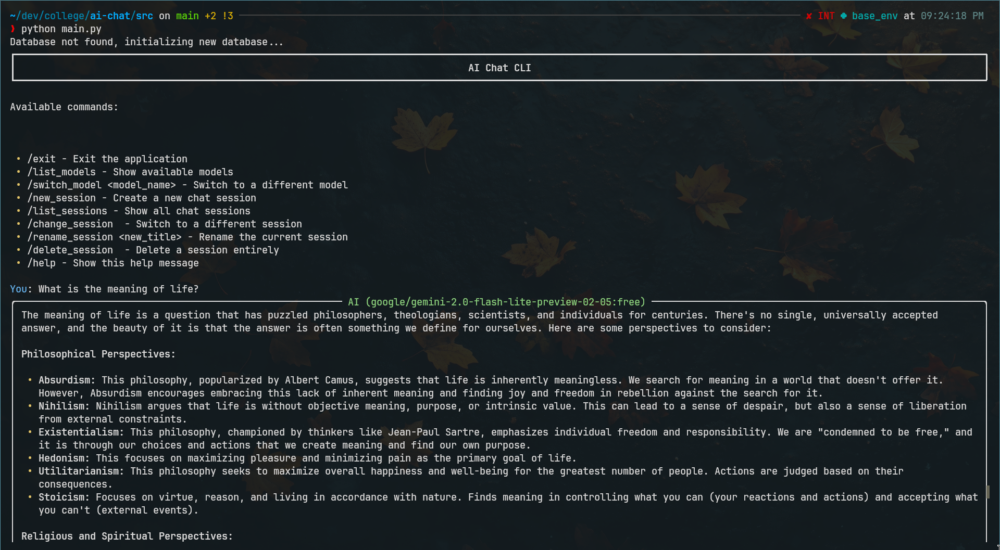
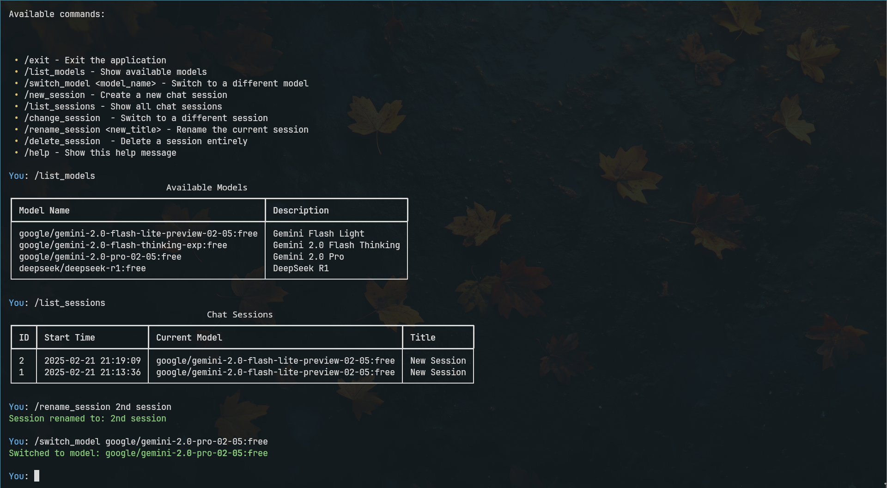

# AI Chat CLI 🤖

A simple and modular CLI-based AI chat application with multiple sessions, persistent history, and configurable model management.

## Features

- Interactive CLI with session management
- Dynamic model loading from `models.yaml`
- Persistent chat history using SQLite Database
- Configurable settings via `config.yaml`
- Modular architecture for easy expansion

## Installation

1. Clone the repository:
   ```bash
   git clone https://github.com/udaymehta/easy-chat.git && cd easy-chat
   ```
2. Install dependencies:
   ```bash
   pip install -r requirements.txt
   ```
3. Set up your config in `config.yaml` file (for the sake of brevity I'm using OpenRouter API)
   ```yaml
    api_key: "API_KEY_HERE"
    base_url: "https://openrouter.ai/api/v1"
    database_file: "chat_history.db"
    default_model: "google/gemini-2.0-flash-lite-preview-02-05:free"
    history_file: ".chat_history"
   ```
4. Run the application:
   ```bash
   python src/main.py
   ```

## Preview


<br>


## To-Do

- [ ] Async API calls
- [ ] Session export/import
- [ ] Enhanced command parsing
- [ ] User authentication
- [ ] Context management

## License

This project is licensed under the MIT License. 
